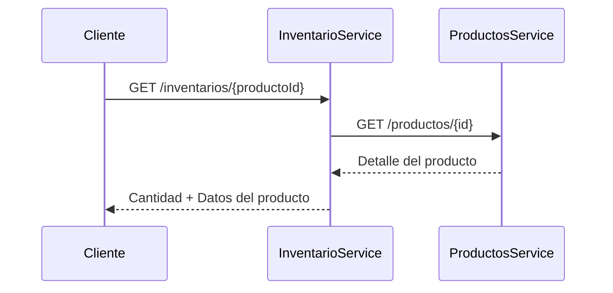

# Api_Products_Inventory
# 🧪 Prueba Técnica Backend - Microservicios de Productos e Inventario

Este proyecto implementa dos microservicios independientes con Java y Spring Boot: **Productos** e **Inventario**, que se comunican entre sí usando JSON API por HTTP.

---

## 🚀 Instrucciones de instalación y ejecución (modo local)

### 🔧 Requisitos previos
- JDK 17+
- Maven
- (Opcional) Postman para probar los endpoints

### ▶️ Cómo ejecutar los microservicios

#### 1. Microservicio de Productos

```bash
cd productos-service
mvn clean install
mvn spring-boot:run
```

Por defecto se ejecuta en el puerto **8081**. Acceso a Swagger:

```
http://localhost:8081/swagger-ui.html
```

#### 2. Microservicio de Inventario

```bash
cd inventario-service
mvn clean install
mvn spring-boot:run
```

Por defecto se ejecuta en el puerto **8082**. Acceso a Swagger:

```
http://localhost:8082/swagger-ui.html
```

---

## 🧱 Arquitectura del sistema

El sistema está compuesto por dos microservicios:

- **Productos Service**: Provee endpoints para crear, leer, actualizar, eliminar y listar productos.
- **Inventario Service**: Permite consultar y modificar la cantidad de productos en stock.

Comunicación entre servicios vía HTTP con `WebClient`.

---

## ⚙️ Decisiones técnicas y justificaciones

- **Spring Boot**: Framework rápido y robusto para construir APIs REST.
- **Base de datos H2**: Elegida por simplicidad durante el desarrollo. Ideal para pruebas.
- **WebClient**: Alternativa moderna a `RestTemplate`, con mejor soporte para manejo de errores y futura escalabilidad.
- **Estructura limpia**: Separación de capas (controlador, servicio, repositorio).
- **Documentación automática con Swagger**.

---

## 🔄 Diagrama de interacción entre microservicios



---

## 📚 Documentación Swagger

Los endpoints de cada microservicio están documentados automáticamente con Swagger.

- Productos: `http://localhost:8081/swagger-ui.html`
- Inventario: `http://localhost:8082/swagger-ui.html`

---

## 👨‍💻 Autor

- Johan Alberto Domínguez Acosta 
- johanalbertodominguezacosta@gmail.com
